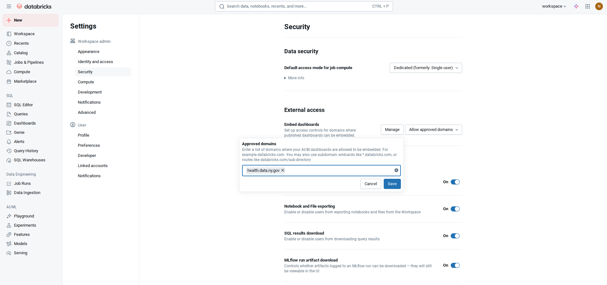
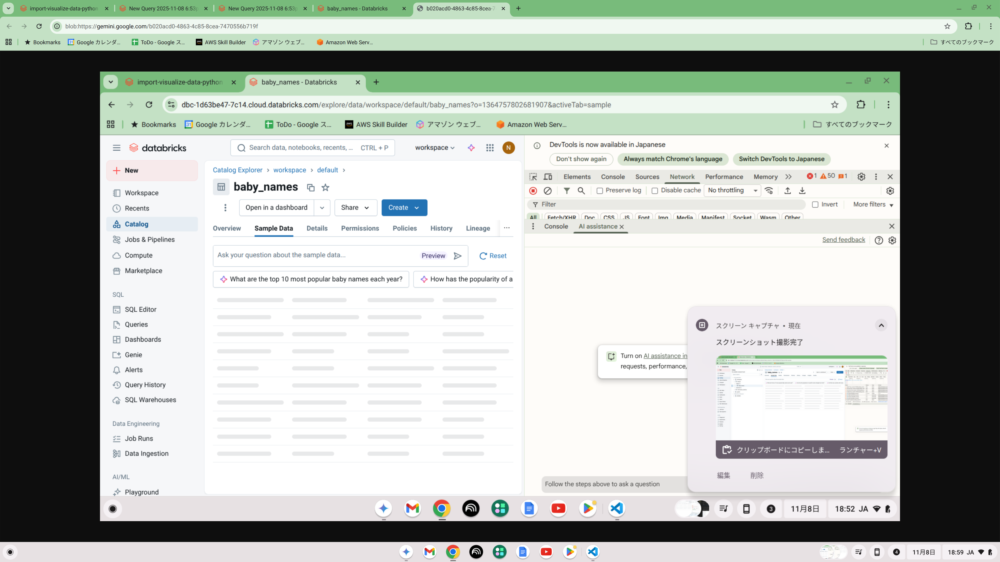

# Databricks

## 参考資料

- [公式サイト](https://www.databricks.com/jp)

    Databricksのコーポレートサイトも兼ねたサイト。Databricksの概要や導入事例について説明。

- [公式ドキュメント](https://www.databricks.com/databricks-documentation)

    技術ドキュメント。AWS,Azure,GCPそれぞれ記載。

- [公式チュートリアル](https://docs.databricks.com/aws/ja/getting-started)

    このセクションのチュートリアルでは、主要な機能を紹介し、Databricks プラットフォームの基本操作について説明します。

- [公式トレーニングと認定](https://www.databricks.com/jp/learn/training/home) 

    公式が提供しているトレーニングや動画。日本語もそれなりにある。

    - [日本語×無料トレーニング](https://www.databricks.com/training/catalog?languages=JA&costs=free)
    - おすすめトレーニング
      - [Databricks Fundamentals - Japanese](https://www.databricks.com/jp/training/catalog/databricks-fundamentals-japanese-2298)
      - [Get Started with Databricks for Data Engineering - Japanese](https://www.databricks.com/jp/training/catalog/get-started-with-databricks-for-data-engineering-japanese-2438)
      - [Databricks Platform Administration Fundamentals - Japanese](https://www.databricks.com/jp/training/catalog/databricks-platform-administration-fundamentals-japanese-4662)
      - [Developing Applications with Apache Spark™ - Japanese](https://www.databricks.com/jp/training/catalog/developing-applications-with-apache-spark-japanese-4554)
      - [Build Data Pipelines with Lakeflow Declarative Pipelines - Japanese](https://www.databricks.com/jp/training/catalog/build-data-pipelines-with-lakeflow-declarative-pipelines-japanese-3284)

        まだやってない。トレーニング説明だけ見て判断)


# TODO
- [ ] 公式サイトを参照
- [ ] Databricksアカウントを作成
- [ ] 公式チュートリアルを実施

## 専門用語集

- **Medallion Architecture**

    レイクハウス内のデータを論理的に整理するためのデータ設計パターン。データ品質を段階的に向上させるために、データを3つの層（Bronze, Silver, Gold）に分類します。マルチホップ・アーキテクチャとも呼ばれます。

- **Bronze Layer**

    Medallion Architecture の最初の層。外部ソースから取り込まれた未加工（Raw）データがそのまま保存されます。データの完全性と監査可能性を維持することが目的です。

- **Silver Layer**

    Medallion Architecture の中間層。ブロンズ層のデータに対して、クレンジング、フィルタリング、検証、重複排除、データ結合などが行われ、信頼性の高いデータセットが作成されます。

- **Gold Layer**

    Medallion Architecture の最終層。ビジネスユーザーが分析、BI（ビジネスインテリジェンス）、または機械学習などにすぐに利用できるよう、集計やビジネスロジックが適用されたデータが格納されます。

- **Databricks Lakehouse Platform**

    データレイクとデータウェアハウスの利点を統合した Databricks のアーキテクチャ。  
    データガバナンスとセキュリティを備え、構造化・非構造化データを扱うことができます。

- **Unity Catalog**

    Databricks Lakehouse Platform 全体で、データ、分析、機械学習ワークロードに対して集中型ガバナンス、きめ細かなアクセス制御、および監査を提供するソリューション。

- **Delta Lake**

    データレイク上に信頼性、セキュリティ、パフォーマンスを提供するために設計されたオープンソースのストレージレイヤー。ACIDトランザクション、スケーラブルなメタデータ処理、データバージョン管理などを可能にします。

- **Apache Spark**

    大規模なデータ処理のためのオープンソースの分散コンピューティングシステム。  
    Databricks の基盤技術の一つです。

- **Databricks Runtime**

    Databricks によって管理・最適化された Apache Spark 環境。  
    パフォーマンス、セキュリティ、互換性を強化するための追加コンポーネントを含みます。

- **Notebooks**

    コード、視覚化、および散文を組み合わせることができる対話型のウェブベースのインターフェース。  
    データ分析、機械学習、データ処理などで使用されます。

- **Cluster/Compute**

    ノートブックやジョブの実行に使用されるコンピューティングリソース。  
    以前は「クラスター」と呼ばれていましたが、UI全体で「コンピュート」に置き換わっています。

- **Jobs**

    スケジュールに基づいて、または手動で実行される非対話型のワークロード（データ処理やETLなど）。

- **Delta Live Tables (DLT)**

    宣言的なETLパイプラインを構築するためのフレームワーク。
    データ品質のチェック、依存関係の管理、自動的なエラー処理などを簡素化します。

- **Workspace**

    ノートブック、ライブラリ、実験などを保存・共有するためのフォルダ階層。  
    データそのものを格納する場所ではありません。

- **MLflow**

    機械学習のライフサイクル（実験の追跡、再現可能な実行、モデルのデプロイ）を管理するためのオープンソースプラットフォーム。  
    Databricksに統合されています。

- **Databricks Community Edition**
  
  自分を含めて最大3名までのユーザーをワークスペースに追加可能。  
  クラスターのサイズや種類の選択肢が制限されます。

- **Databricks Enterprise Edition**

    企業組織用のアカウント。Community Editionに設定されている様々な制約が解除されている。

- **DataFrame**

    [公式解説](https://www.databricks.com/jp/glossary/what-are-dataframes)  
    構造化されたデータを扱うための、列を持つ2次元のラベル付きデータ構造のことです。データフレームは、スプレッドシートやSQLのテーブルのようなものと考えると理解しやすいでしょう。Databricksで扱うデータフレームは、通常、Sparkデータフレームを指します。 by  Gemini

- **SQL WareHouse**


- **Database instance**

## 主なリソース

- Users
- Notebook
- Catalog
- Schema
- Table
- Volume

## 環境構築

Databricksの構築を行うための環境構築。

1. Databricksアカウントの登録

    [Databricks公式サイト](https://www.databricks.com/jp)からアカウントを作成。  

2. Databricksユーザーの登録

- クライアントに必要なソフトウェアをインストール

    [ローカル開発ツール](https://docs.databricks.com/aws/ja/dev-tools/)を参考に環境を構築。以下（たぶん）よく利用する開発ツール。

  - Visual Studio Code
  - Visual Studio Code 拡張機能：Databricksの登録
  - Databricks CLI

## 主なオペレーション/メンテナンス

- Databricks Enterprise Editionアカウントの契約
- ユーザー登録/ユーザー削除
- Workspacの作成/削除
- Workspacにユーザーを招待/削除
- Notebookの作成/削除
- NotebookでSQLを実行
- Notebookでデータをビジュアル化
- NotebookでCSVのデータをインポート
- Notebookで変数を定義する
- アカウントの設定でインターネットへの接続設定を変更
- SQL Editorを利用してSQLを実行
- SQL Editorで利用するComputeリソースを作成
- SQL WareHouseを構築
- Databaes instanceを構築
- CSVをDataCatalogにインポート

## 主なデベロップメント

- 
-
-

## 主なインテグレーション

- AWS
- Azure
- GCP
- GitHub

## チュートリアル補足
|タイトル|所要時間目安|
|--------|------------|
|[チュートリアル: ノートブックからのデータのクエリと視覚化](https://docs.databricks.com/aws/ja/getting-started/quick-start)|15分|
|[チュートリアル: ノートブックから CSV データをインポートして視覚化する](https://docs.databricks.com/aws/ja/getting-started/import-visualize-data)|30分|


### チュートリアル: ノートブックから CSV データをインポートして視覚化する

- 以下ネットワークに関するエラーが発生。

回避策：アカウントの設定画面から外部接続を許可。
```
ExecutionError: (java.net.UnknownHostException) health.data.ny.gov
```

設定したときは改善しなかったが1週間後に試したらできた。
反映速度の問題？
今度はOFFにして、もう少し寝かせる。

- 作成したテーブルのサンプルデータが参照できない
回避策：SQL WareHouseを構築


