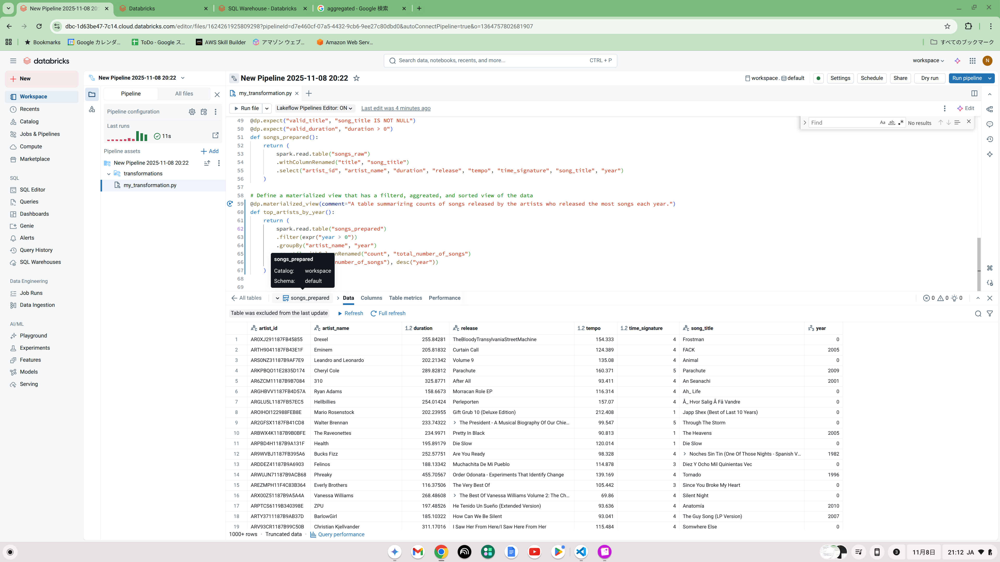
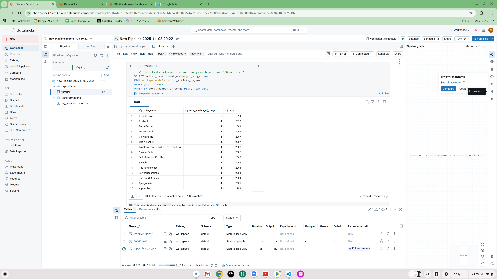
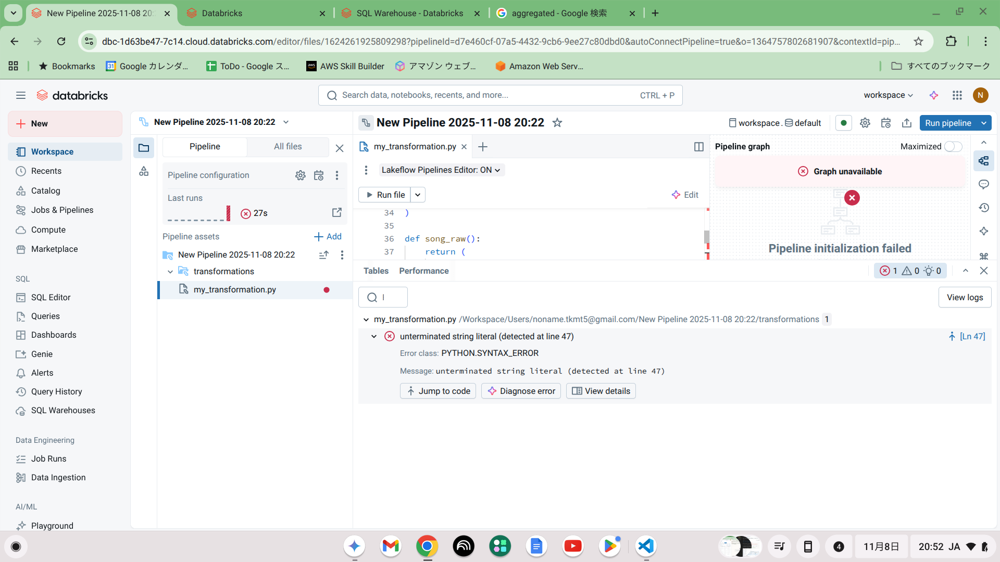

# Databricks

## 参考資料

- [公式サイト](https://www.databricks.com/jp)

    Databricksのコーポレートサイトも兼ねたサイト。Databricksの概要や導入事例について説明。

- [公式ドキュメント](https://www.databricks.com/databricks-documentation)

    技術ドキュメント。AWS,Azure,GCPそれぞれ記載。

- [公式チュートリアル](https://docs.databricks.com/aws/ja/getting-started)

    このセクションのチュートリアルでは、主要な機能を紹介し、Databricks プラットフォームの基本操作について説明します。

- [公式トレーニングと認定](https://www.databricks.com/jp/learn/training/home) 

    公式が提供しているトレーニングや動画。日本語もそれなりにある。

    - [日本語×無料トレーニング](https://www.databricks.com/training/catalog?languages=JA&costs=free)
    - おすすめトレーニング
      - [Databricks Fundamentals - Japanese](https://www.databricks.com/jp/training/catalog/databricks-fundamentals-japanese-2298)
      - [Get Started with Databricks for Data Engineering - Japanese](https://www.databricks.com/jp/training/catalog/get-started-with-databricks-for-data-engineering-japanese-2438)
      - [Databricks Platform Administration Fundamentals - Japanese](https://www.databricks.com/jp/training/catalog/databricks-platform-administration-fundamentals-japanese-4662)
      - [Developing Applications with Apache Spark™ - Japanese](https://www.databricks.com/jp/training/catalog/developing-applications-with-apache-spark-japanese-4554)
      - [Build Data Pipelines with Lakeflow Declarative Pipelines - Japanese](https://www.databricks.com/jp/training/catalog/build-data-pipelines-with-lakeflow-declarative-pipelines-japanese-3284)

        まだやってない。トレーニング説明だけ見て判断)


# TODO
- [ ] 公式サイトを参照
- [ ] Databricksアカウントを作成
- [ ] 公式チュートリアルを実施

## 専門用語集

- **Medallion Architecture**

    レイクハウス内のデータを論理的に整理するためのデータ設計パターン。データ品質を段階的に向上させるために、データを3つの層（Bronze, Silver, Gold）に分類します。マルチホップ・アーキテクチャとも呼ばれます。

- **Bronze Layer**

    Medallion Architecture の最初の層。外部ソースから取り込まれた未加工（Raw）データがそのまま保存されます。データの完全性と監査可能性を維持することが目的です。

- **Silver Layer**

    Medallion Architecture の中間層。ブロンズ層のデータに対して、クレンジング、フィルタリング、検証、重複排除、データ結合などが行われ、信頼性の高いデータセットが作成されます。

- **Gold Layer**

    Medallion Architecture の最終層。ビジネスユーザーが分析、BI（ビジネスインテリジェンス）、または機械学習などにすぐに利用できるよう、集計やビジネスロジックが適用されたデータが格納されます。

- **Databricks Lakehouse Platform**

    データレイクとデータウェアハウスの利点を統合した Databricks のアーキテクチャ。  
    データガバナンスとセキュリティを備え、構造化・非構造化データを扱うことができます。

- **Unity Catalog**

    Databricks Lakehouse Platform 全体で、データ、分析、機械学習ワークロードに対して集中型ガバナンス、きめ細かなアクセス制御、および監査を提供するソリューション。

- **Delta Lake**

    データレイク上に信頼性、セキュリティ、パフォーマンスを提供するために設計されたオープンソースのストレージレイヤー。ACIDトランザクション、スケーラブルなメタデータ処理、データバージョン管理などを可能にします。

- **Apache Spark**

    大規模なデータ処理のためのオープンソースの分散コンピューティングシステム。  
    Databricks の基盤技術の一つです。

- **Databricks Runtime**

    Databricks によって管理・最適化された Apache Spark 環境。  
    パフォーマンス、セキュリティ、互換性を強化するための追加コンポーネントを含みます。

- **Notebooks**

    コード、視覚化、および散文を組み合わせることができる対話型のウェブベースのインターフェース。  
    データ分析、機械学習、データ処理などで使用されます。

- **Cluster/Compute**

    ノートブックやジョブの実行に使用されるコンピューティングリソース。  
    以前は「クラスター」と呼ばれていましたが、UI全体で「コンピュート」に置き換わっています。

- **Jobs**

    スケジュールに基づいて、または手動で実行される非対話型のワークロード（データ処理やETLなど）。

- **Delta Live Tables (DLT)**

    宣言的なETLパイプラインを構築するためのフレームワーク。
    データ品質のチェック、依存関係の管理、自動的なエラー処理などを簡素化します。

- **Workspace**

    ノートブック、ライブラリ、実験などを保存・共有するためのフォルダ階層。  
    データそのものを格納する場所ではありません。

- **MLflow**

    機械学習のライフサイクル（実験の追跡、再現可能な実行、モデルのデプロイ）を管理するためのオープンソースプラットフォーム。  
    Databricksに統合されています。

- **Databricks Community Edition**
  
  自分を含めて最大3名までのユーザーをワークスペースに追加可能。  
  クラスターのサイズや種類の選択肢が制限されます。

- **Databricks Enterprise Edition**

    企業組織用のアカウント。Community Editionに設定されている様々な制約が解除されている。

- **DataFrame**

    [公式解説](https://www.databricks.com/jp/glossary/what-are-dataframes)  
    構造化されたデータを扱うための、列を持つ2次元のラベル付きデータ構造のことです。データフレームは、スプレッドシートやSQLのテーブルのようなものと考えると理解しやすいでしょう。Databricksで扱うデータフレームは、通常、Sparkデータフレームを指します。 ```by  Gemini```

- **SQL WareHouse**

    [公式解説](https://docs.databricks.com/aws/ja/compute/sql-warehouse/)  
    SQLウェアハウスは、Databricks 上のデータのクエリと探索を可能にするコンピュート リソースです。
    ほとんどのユーザーは、管理者によって設定された SQLウェアハウスにアクセスできます。
    サーバレス コンピュートプレーンのアーキテクチャについては、サーバレス コンピュートプレーンを参照してください。
    Databricks では、利用可能な場合はサーバーレス SQLウェアハウスを使用することをお勧めします。 ```公式解説抜粋```

- **Database instance**

    [公式解説](https://docs.databricks.com/aws/ja/oltp/instances/instance)  
    Lakebase データベース インスタンスは、ストレージと コンピュート リソースを管理し、ユーザーが接続するエンドポイントを提供します。 このページには、データベース・インスタンスとその一般的な制限事項の概要が含まれています。 ```公式解説抜粋```

- **探索的データ分析(EDA)**

    [公式解説](https://docs.databricks.com/aws/ja/exploratory-data-analysis/) /
    [公式チュートリアル](https://docs.databricks.com/aws/ja/notebooks/eda-tutorial)

    探索的データ分析 (EDA) には、データ セットを探索して、その主な特性を要約し、データの問題を特定する方法が含まれています。 統計的手法と視覚化を使用して、データセットについて学習し、分析の準備が可能かどうかを判断し、データ準備に適用すべき手法を通知できます。 EDA は、ML モデルのトレーニングに適用するアルゴリズムにも影響を与える可能性があります。 ```公式解説抜粋```

- **Lakeflow宣言型パイプライン / パイプライン構文**

    [公式解説](https://docs.databricks.com/aws/ja/dlt/) / 
    [公式tutorial](https://docs.databricks.com/aws/ja/dlt/tutorials)

    Lakeflow 宣言型パイプラインは、 SQL と Pythonでバッチおよびストリーミング データパイプラインを作成するためのフレームワークです。 Lakeflow宣言型パイプラインの一般的なユースケースには、クラウドストレージ(Amazon S3、Azure ADLS Gen2、Google Cloud Storageなど)やメッセージバス(Apache Kafka、Amazon Kinesis、Google Pub/Sub、 Azure EventHub、Apache Pulsar)、およびインクリメンタル バッチとストリーミングの変換。 ```公式解説抜粋```


- **インクリメンタルデータ**

- **マテリアライズド・ビュー**


- **Auto Loader**
- **ETL / ELT**

    [公式解説](https://www.databricks.com/jp/glossary/extract-transform-load)

    ETLとは、「Extract（抽出）」「Transform（変換）」「Load（格納）」という3つの頭文字をとった、データ統合処理の基本的なプロセスを指します。
    主に、企業内に散在する様々なデータソースから必要な情報を集め、分析や活用に適した形に整えて、**データウェアハウス（DWH）**などの一元的な場所に格納するために用いられます。```by Gemini```

## 主なリソース

- Users
- Notebook
- Catalog
- Schema
- Table
- Volume

## 環境構築

Databricksの構築を行うための環境構築。

1. Databricksアカウントの登録

    [Databricks公式サイト](https://www.databricks.com/jp)からアカウントを作成。  

2. Databricksユーザーの登録

- クライアントに必要なソフトウェアをインストール

    [ローカル開発ツール](https://docs.databricks.com/aws/ja/dev-tools/)を参考に環境を構築。以下（たぶん）よく利用する開発ツール。

  - Visual Studio Code
  - Visual Studio Code 拡張機能：Databricksの登録
  - Databricks CLI

## 主なオペレーション/メンテナンス

- Databricks Enterprise Editionアカウントの契約
- ユーザー登録/ユーザー削除
- Workspacの作成/削除
- Workspacにユーザーを招待/削除
- Notebookの作成/削除
- NotebookでSQLを実行
- Notebookでデータをビジュアル化
- NotebookでCSVのデータをインポート
- Notebookで変数を定義する
- アカウントの設定でインターネットへの接続設定を変更
- SQL Editorを利用してSQLを実行
- SQL Editorで利用するComputeリソースを作成
- SQL WareHouseを構築
- Databaes instanceを構築
- CSVをDataCatalogにインポート
- [Tableを作成](https://docs.databricks.com/aws/ja/tables/managed)
- [Catalogの作成](https://docs.databricks.com/aws/ja/catalogs/create-catalog)
- [Schemaの作成](https://docs.databricks.com/aws/ja/schemas/create-schema)
- [Viewの作成](https://docs.databricks.com/aws/ja/views/create-views)
- [Volumeの作成](https://docs.databricks.com/aws/ja/volumes/)
- [権限の管理](https://docs.databricks.com/aws/ja/data-governance/unity-catalog/manage-privileges/)
- [探索的データ分析(EDA)手法](https://docs.databricks.com/aws/ja/data-governance/unity-catalog/manage-privileges/)

## 主なデベロップメント
- ETLパイプラインロジックの構築(Python or SQL)
- JOBを定義してETLパイプラインの実行をスケジュール
-

## 主なインテグレーション

- AWS
- Azure
- GCP
- GitHub

## チュートリアル補足

### はじめに
|タイトル|所要時間目安|
|--------|------------|
|[ノートブックからのデータのクエリと視覚化](https://docs.databricks.com/aws/ja/getting-started/quick-start)|15分|
|[ノートブックから CSV データをインポートして視覚化する](https://docs.databricks.com/aws/ja/getting-started/import-visualize-data)|30分|
|[初めてのテーブルを作成し、特権を付与する](https://docs.databricks.com/aws/ja/getting-started/create-table)|15分|
|[ETL Lakeflow宣言型パイプラインを使用して パイプラインを構築する](https://docs.databricks.com/aws/ja/notebooks/eda-tutorial)|60分|


### チュートリアル: ノートブックから CSV データをインポートして視覚化する

- 以下ネットワークに関するエラーが発生。

    対応：アカウントの設定画面から外部接続を許可。
    ```
    ExecutionError: (java.net.UnknownHostException) health.data.ny.gov
    ```
    
    設定したときは改善しなかったが1週間後に試したらできた。
    反映速度の問題？
    今度はOFFにして、もう少し寝かせる。

- 作成したテーブルのサンプルデータが参照できない

    対応：SQL WareHouseを構築
    

### ETL Lakeflow宣言型パイプラインを使用して パイプラインを構築する
- ステップ２：パイプライン　ロジックの開発/成功の状態

    画面下部にrawデータと２つのマテリアライズド・ビューが表示できたらOK.
    表示まで少し時間がかかるので注意。
    表示されない場合は、マテリアライズド・ビューの定義ロジックを確認。
    

- ステップ３：データセットの探索/成功の状態

    SQLの結果が表示されたらOK
    

- ステップ４：ジョブの作成

    Jobs & PipeLinsの一覧で以下２件が表示されればOK
    

- PythonコードでSYNTAX Errorが出ちゃった(エラーになったらこうなる)

    対応：愚直になおしていく。
    

- データソースが読み込めない（Tableが存在しない）

    対応：浅田の場合はスペルミスだったので修正

    修正前コード
    ```Python
    def song_raw():
        return (
            spark.readStream
                .format("cloudFiles")
                .schema(schema)
                .option("cloudFiles.format", "csv")
                .option("sep","\t")
                .load(file_path)
        )
    ```
    修正後コード
    ```Python
    def songs_raw():
        return (
            spark.readStream
                .format("cloudFiles")
                .schema(schema)
                .option("cloudFiles.format", "csv")
                .option("sep","\t")
                .load(file_path)
        )
    ```
    エラーメッセージ
    ```
    pyspark.errors.exceptions.captured.AnalysisException: Traceback (most recent call last):
    File "/Workspace/Users/noname.tkmt5@gmail.com/New Pipeline 2025-11-08 20:22/transformations/my_transformation.py", cell 1, line 53, in songs_prepared
        spark.read.table("songs_raw")

    pyspark.errors.exceptions.captured.AnalysisException: [TABLE_OR_VIEW_NOT_FOUND] The table or view `workspace`.`default`.`songs_raw` cannot be found. Verify the spelling and correctness of the schema and catalog.
    If you did not qualify the name with a schema, verify the current_schema() output, or qualify the name with the correct schema and catalog.
    To tolerate the error on drop use DROP VIEW IF EXISTS or DROP TABLE IF EXISTS. SQLSTATE: 42P01;
    'UnresolvedRelation [workspace, default, songs_raw], [], false
    ```


## 雑多メモ
- 標準的なテスト仕様書、基本設計書とか。サンプルとか作る
- Assistantの言語を日本語化したい
- ETLパイプラインの設計標準、ベストプラクティス、アンチパターン、テスト仕様とか考える